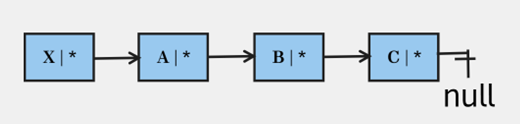

# Task – Part 1

**Illustrate in a drawing the process of adding a new node on the first position. Explain what happens in each step.**

Let’s take linked list

1\.      Create a new element for example (X)

2\.      Set the pointer of the (X) object to the next element for example (A)

3\.      Assign the head to the (X)

&#x20;

<figure><figcaption>
<strong>adding a new node on the first position</strong>
</figcaption></figure>

&#x20;

Illustrate in a drawing the process of adding a new node on the last position. Explain what happens in each step.

Let’s take linked list

1\.      Create (X) a new element.

2\.      A loop to go to the end of the elements.

3\.      Change the pointer of © from null to the (X) element.

4\.      Set the next pointer of (X) to null.

<figure><figcaption>
adding a new node on the last position
</figcaption></figure>

